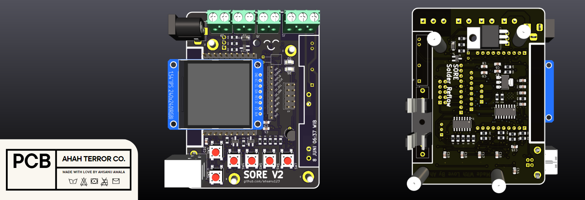
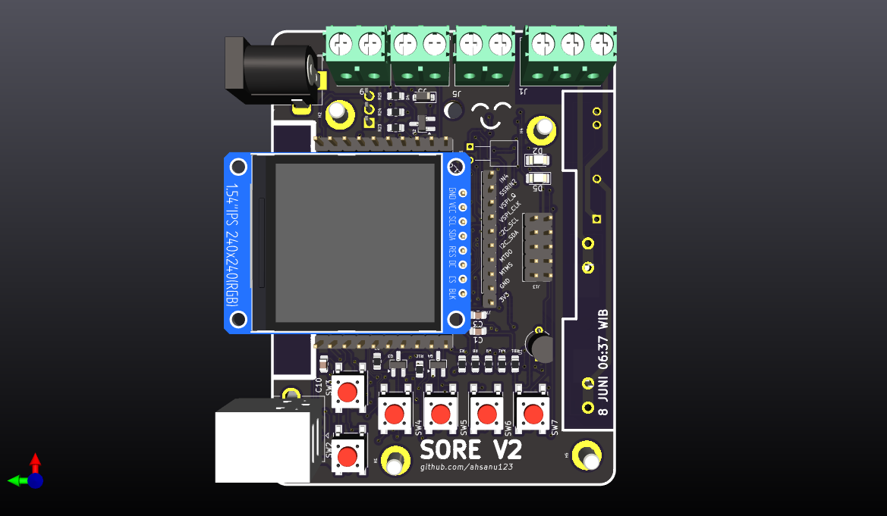
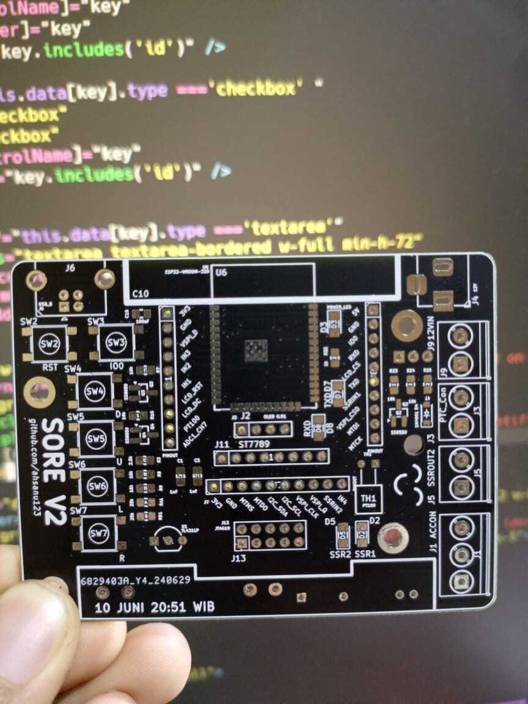

 <h1 align="center">🌕 SORE</h1>
<p align="center">The DIY Solder Reflow 
<p align="center">
  <a href="https://github.com/ahsanu123/solder-reflow">
   
  </a>
</p>

<p align="center">
  <a href="">
    
  </a>
  <a href="">
    
  </a>
  <a href="">
    
  </a>
  <br />
  <a href="https://github.com/ahsanu123/solder-reflow/blob/main/LICENSE">
    
  </a>
</p>

## ✏️ SORE - Solder Reflow

Designed With [KICAD](https://www.kicad.org)

<p align="center" style="background-color: white;">

</p>

## 🥈 Version 2.0 - Main Info

<p align="center" style="background-color: white;">

</p>

> - 🥑 Built In 5V and 3.3v Voltage Source
> - 0️⃣ Built in SSR Zero Crossing
> - ⛓️ Built In USB Serial Interface
> - 🎣 Use TL074 For PT100 Signal Conditioning
> - 🌮 5 Programmable User Input
> - 🍒 Use ESP32-Wroom
> - 🥓 10 Pin JTAG Connector
> - 🧢 0.91' OLED or 1.3' TFT

## 🐞 Debugging 
there is many way to debug ESP32 use JTAG, refer to [documentation](https://docs.espressif.com/projects/esp-idf/en/stable/esp32/api-guides/jtag-debugging/index.html). 
at this time i only got JLink V8(2014),

🧰 Requirements 
> xtensa-esp32-elf toolchain
> openocd-esp32 (fork of official openocd)
> JLink

🪜 Step To Debug 
1. connect your board with jlink like this [ref](https://gojimmypi.github.io/ESP32-JTAG-GDB-Debugging/) (make sure your JLink and esp32 power up
```txt
TDI -> GPIO12
TCK -> GPIO13
TMS -> GPIO14
TDO -> GPIO15
TRST -> EN / RST (Reset)
GND -> GND
```
2. start openocd-esp32 (use sudo if needed) `sudo openocd -f interface/jlink.cfg -c "adapter speed 500" -f target/esp32.cfg`
3. next start your esp32 gdb  `xtensa-esp32-elf-gdb path/to/your/name.elf`
4. inside gdb cli [see this why connecting twice](https://esp32.com/viewtopic.php?t=9719#p40510)
```shell
target remote localhost:3333 
target remote localhost:3333 // dont know esp32 connected after try to connecting twice (doesn't need do twice if already connected
//🐞 Enjoy debug
```

5. Done ✔️
---


🍾 **example gdb remote connection success**
```shell
(gdb) target remote localhost:3333
Remote debugging using localhost:3333
0x400845e6 in esp_cpu_wait_for_intr () at /home/ahsanu/esp/esp-idf/components/esp_hw_support/cpu.c:145 145}
```
🍾 **example openocd connection success**
```shell
$ sudo openocd -f interface/jlink.cfg -c "adapter speed 500" -f target/esp32.cfg
Open On-Chip Debugger v0.12.0-esp32-20240318 (2024-03-18-18:25)
Licensed under GNU GPL v2
For bug reports, read
        http://openocd.org/doc/doxygen/bugs.html
adapter speed: 500 kHz
Info : auto-selecting first available session transport "jtag". To override use 'transport select <transport>'.
Info : Listening on port 6666 for tcl connections
Info : Listening on port 4444 for telnet connections
Info : J-Link ARM V8 compiled Nov 28 2014 13:44:46
Info : Hardware version: 8.00
Info : VTarget = 3.371 V
Info : clock speed 500 kHz
Info : JTAG tap: esp32.cpu0 tap/device found: 0x120034e5 (mfg: 0x272 (Tensilica), part: 0x2003, ver: 0x1)
Info : JTAG tap: esp32.cpu1 tap/device found: 0x120034e5 (mfg: 0x272 (Tensilica), part: 0x2003, ver: 0x1)
Info : [esp32.cpu0] Examination succeed
Info : [esp32.cpu1] Examination succeed
Info : starting gdb server for esp32.cpu0 on 3333
Info : Listening on port 3333 for gdb connections
```

## 🌱 V2 Project Progress

<details>
 <summary>
  Show Picture 
 </summary>
 <p align="center">
  <a href="https://github.com/ahsanu123/solder-reflow">
   
  </a>
</p>
</details>


- PCB Design Finished 10 june 2024 20:51
- Order _BOM_ and PCB
- PCB and BOM Arrive 12 july 2024 about 16:00
- Start to soldering 13 july 2024 about 06:00 (**weekend**)
- make adc class to simplify adc initialization 23 july 2024 at 21:21
- Check Out GPIO (Worked!!😃) 26 july 2024 at 22:24
- Try to use JLink for jtag debugging, but fail 😞 , 27 july 2024 at 17:30
- Try again to use JLink for jtag debugging, Worked!! 😃 , 28 july 2024 at 11:36

<details>
<summary>Several Notes</summary>

## 📔 Note to Myself
this is just my own diy solder reflow made from seferal reference accross internet.
at initial of this project, i want:
  1. use ptc heater instead of iron 
  2. design some case for this project 
  3. use esp32 or wemos
  4. use native toolchain instead arduino 
  6. make good documentation about this project 

## 🐍 Reference
- maker moekoe: https://github.com/makermoekoe/Hotplate-Soldering-Iron  
- casing design: https://cdn.shopify.com/s/files/1/1978/9859/files/DSC_7360.jpg?v=1609830857
 
</details>

<sup> Work In Progress, Made with ♥️ by AH... </sup>

