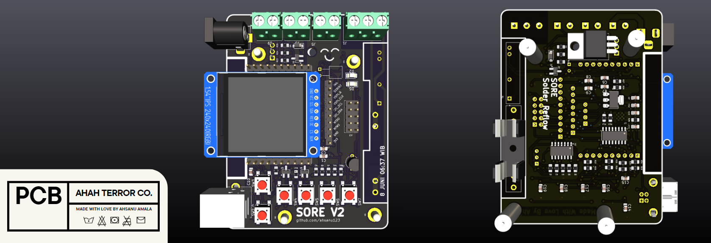
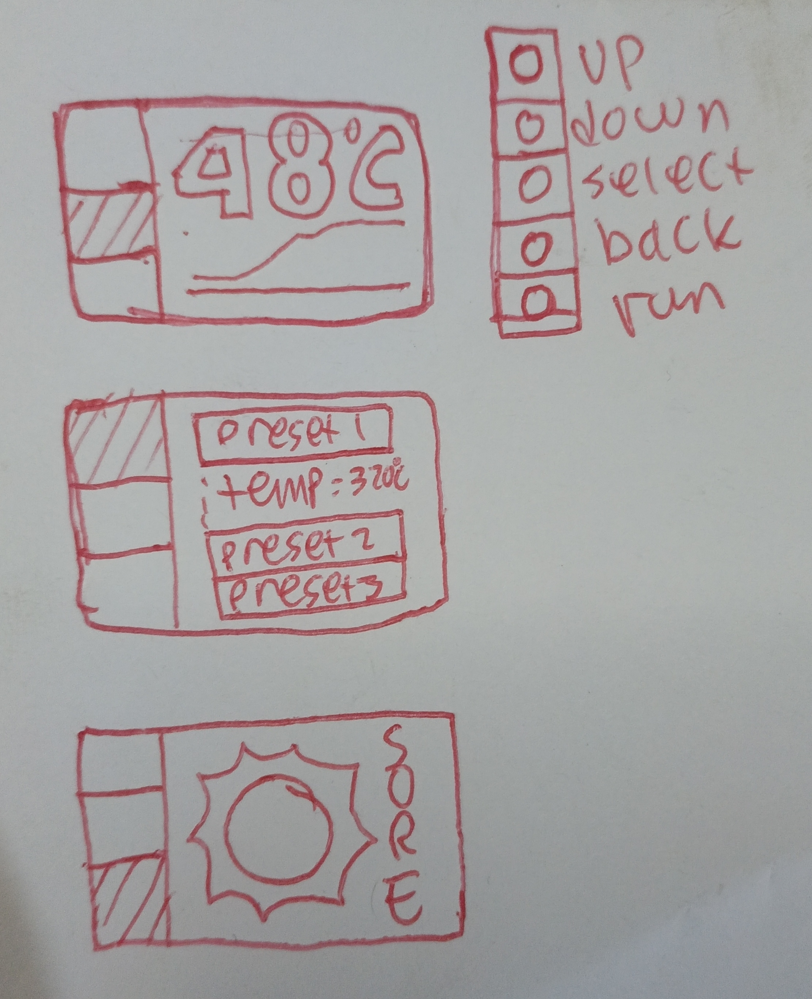
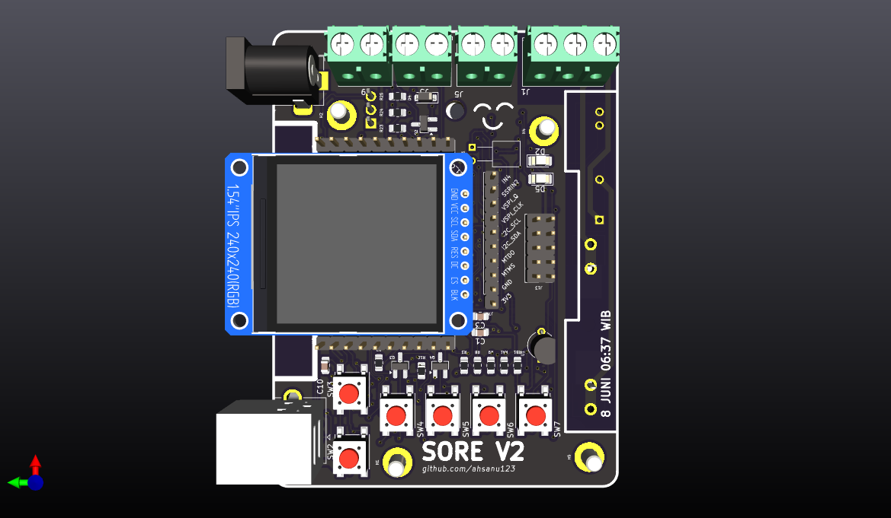
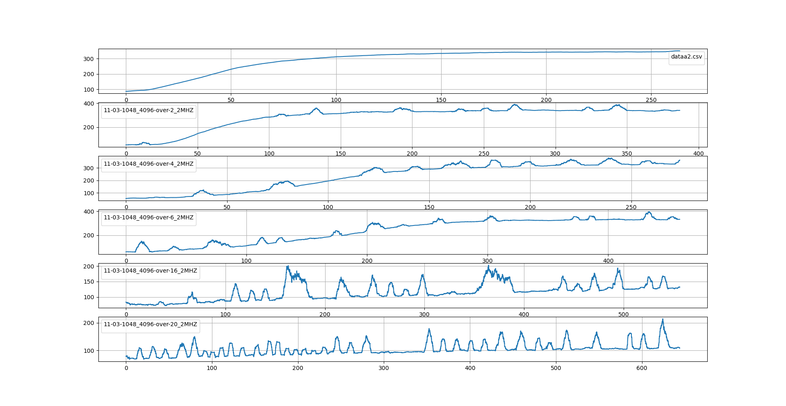
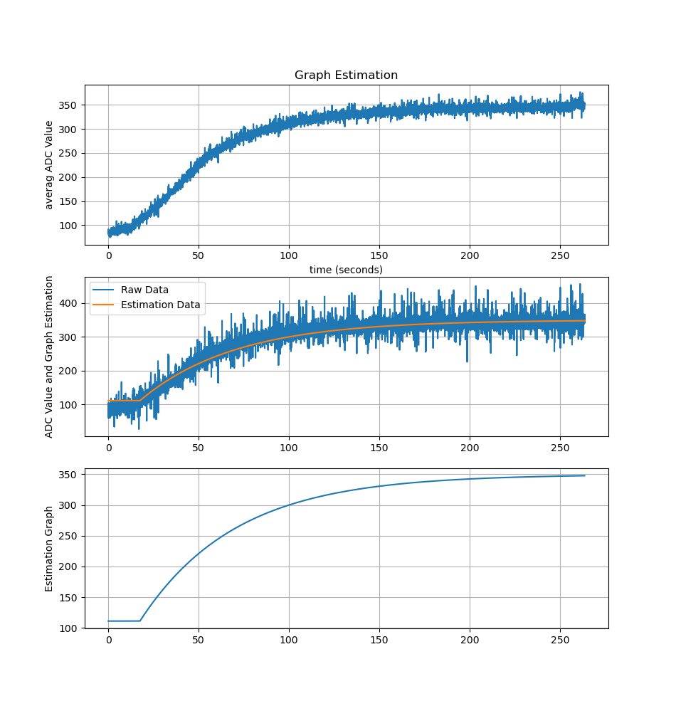
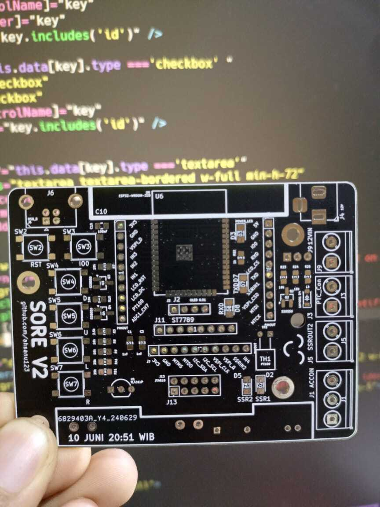

<h1 align="center">🌕 SORE V3</h1>

The DIY Solder Reflow 

  

  
  
  
  

## ✏️ SORE - Solder Reflow

🌕 SORE - Solder Reflow,  DIY hot plate made from several reference across internet, 
use PT100 for temperature sensor controlled with ESP32-WROOM-32D, with 1.47 IPS LCD, 
programmed in ESP IDF Framework with LVGL for display. 

> Designed With [KICAD](https://www.kicad.org)

## 🏆 Note For Version 3

> [!NOTE]
> - still using same ic (still have several of it) will use rust instead of c,
> - add swd/jtag connector that connectable with jlink,
> - try to use power supply module instead of using external adaptor, [Hi-Link](https://www.tokopedia.com/eltech-online/hi-link-3-3v-5v-9v-12v-24v-hi-link-ling-hlk-ac-to-dc-isolation-power-supply-unit-switching-module-catu-daya-adaptor-trafo-all-1731008119444047082?extParam=ivf%3Dfalse%26keyword%3Dpower+supply+ac+dc%26search_id%3D20250611123128432ACA3A1E345E32EJ1R%26src%3Dsearch)
> - correcting display orientation,
> - and try to program it with ratatui embedded backend [mousefood](https://github.com/j-g00da/mousefood)
> - think about how to stack the heater so its not separated, model it with inventor
> - if possible, buy local component only
> - take change to make ui with slint.dev, and make simple ui as sketch below

 
Sketch

  

## 🥈 Version 2.0 - Main Info

> - 🥑 Built In 5V and 3.3v Voltage Source
> - 0️⃣ Built in SSR Zero Crossing
> - ⛓️ Built In USB Serial Interface
> - 🎣 Use LM324 For PT100 Signal Conditioning
> - 🌮 5 Programmable User Input
> - 🍒 Use ESP32-Wroom
> - 🥓 10 Pin JTAG Connector
> - 🧢 0.91' OLED or 1.3' TFT

## 🖍️ Plot of Sampled Data

 

  Plot Collection
 

 
- multiple sampling at 2Mhz (except first one)
signal was moving averaged filter, first graph was actually noisy, and rest was actually not really noisy, but after filtered low noise signal look bumped

- Transfer Function Estimation
$`y(t) = 350(1-e^{(t-d)/tau})`$ in temperature degre (celcius), d = 17.5 second

- first time sampled diagram [30 oktober 2024]

## 🌱 V3 Project Progress

 

  Show Picture 
 

 

  

 
- PCB Design Finished 10 june 2024 20:51
- Order _BOM_ and PCB
- PCB and BOM Arrive 12 july 2024 about 16:00
- Start to soldering 13 july 2024 about 06:00 (**weekend**)
- make adc class to simplify adc initialization 23 july 2024 at 21:21
- Check Out GPIO (Worked!!😃) 26 july 2024 at 22:24
- Try to use JLink for jtag debugging, but fail 😞 , 27 july 2024 at 17:30
- Try again to use JLink for jtag debugging, Worked!! 😃 , 28 july 2024 at 11:36
- Add `Button` class to add Input with callback, 29 Agustus 2024 at 19:42
- ⚠️ turn out, TL074 (not TL074xH) need minimum 10v to operate and not single supply quad opamp 😞, fortunately there is LM324 (same package and single supply support), currently still in shipping, need to wait if it really work or not, 01 september 2024 at 18:05
- ✔️ ok LM324 worked, currently still investigate why adc are really noisy, 03 september 2024 at 13:34
- looks ESP32 IDF adc getting more stable if `frequency` increased, try to use 20Khz but its not stable, but use 1Mhz its more stable 14 september 2024 at 21:00
- ✔️ LVGL worked but task semaphore block update of LVGL (still investigate), 05 oktober 2024 at 10:13
- ✔️ now LVGL with Button input worked!! 😃, need learn more how to map LVGL key to input button, 05 oktober 2024 at 13:23
- ✔️ sampling data from heater and plot it, 30 oktober 2024 at 2015
- ⏰11 June 2025 19:31, make it version 3,

## 🌴 Reference 

- Slint MCU support Discussion -> https://github.com/slint-ui/slint/discussions/5008
- Slint MCU Template (raspi pico) -> https://github.com/slint-ui/slint-mcu-rust-template/blob/main/src/main.rs
- Slint Linux Template (Linux, etc) -> https://github.com/slint-ui/slint-rust-template/tree/main 

 Work In Progress Version 3 for 2025 🔥, Made with ♥️ by AH... 

