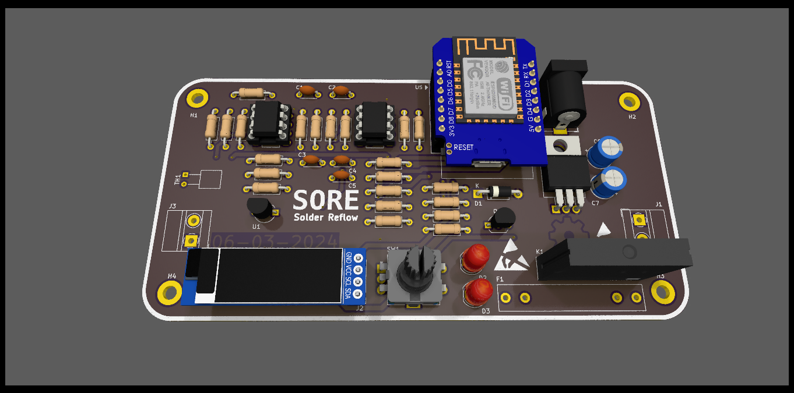

  
  <h2 align="center">SORE</h2>

## SORE - Solder Reflow
designed with kicad 7   
   - Schematic: [SORE](https://github.com/ahsanu123/solder-reflow/blob/main/docs/solder-reflow.pdf)  

## Note to Myself
this is just my own diy solder reflow made from seferal reference accross internet.
at initial of this project, i want:
  1. use ptc heater instead of iron 
  2. design some case for this project 
  3. use esp32 or wemos
  4. use native toolchain instead arduino 
  6. make good documentation about this project 

## Reference
maker moekoe: https://github.com/makermoekoe/Hotplate-Soldering-Iron  
casing design: https://cdn.shopify.com/s/files/1/1978/9859/files/DSC_7360.jpg?v=1609830857

## Made with ♥️ by AH...
